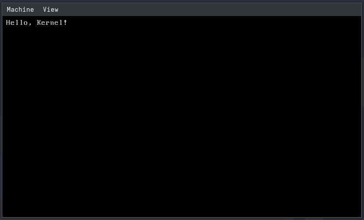

# My OS
A kernel implementation following the guides on [OsDev](https://wiki.osdev.org/Main_Page),  
though it also includes some of my own stuff.

Aditionally there are parts that may come from/are inspired by stuff in this OS development
[playlist](https://www.youtube.com/playlist?list=PL980gcR1LE3LBuWuSv2CL28HsfnpC4Qf7)  

# Dependencies
I made this on Arch linux so if you use a different linux distrobution,
or maybe even a different operating system, this may differ for you.

If you have yay, this command should get you what you need.
```
yay -S i686-elf-gcc grub libisoburn qemu-base rustup
```
(To make the compiling of gcc go faster, you can set the MAKEFLAGS, for example: `MAKEFLAGS=-j5`)

You should also have cargo installed. And you might have to install nightly

# Build
you can build it using the script `build.sh`

# Run
you can run it in qemu using the script `run.sh`

# Screenshots
Some screenshots.

